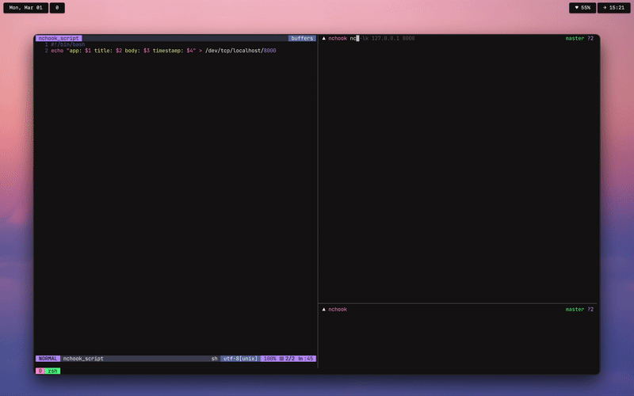

# nchook

A hook into macOS's notification center, to run a script when a notification sent.

## Installation
With homebrew:
`brew install who23/formulae/nchook`

## Usage
Start the nchook daemon with `brew services start nchook`

Create or symlink an executable file at `~/.config/nchook/nchook_script`. This script will
be run with as `nchook_script APP TITLE BODY TIME`. Note that TIME is a unix timestamp in 
seconds.
